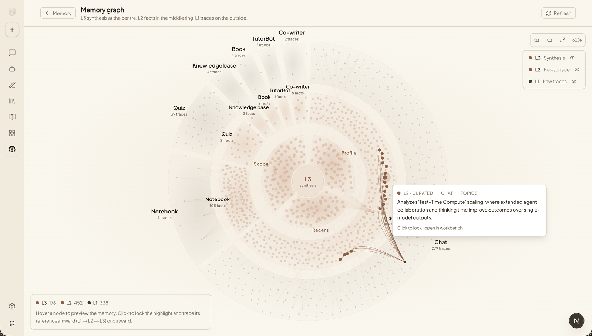

<div align="center">


# DeepTutor：エージェントネイティブなパーソナライズド個別指導

<a href="https://trendshift.io/repositories/17099" target="_blank"></a>

<p align="center">
  <a href="../../README.md"></a>&nbsp;
  <a href="README_CN.md"></a>&nbsp;
  <a href="README_JA.md"></a>&nbsp;
  <a href="README_ES.md"></a>&nbsp;
  <a href="README_FR.md"></a>&nbsp;
  <a href="README_AR.md"></a>&nbsp;
  <a href="README_RU.md"></a>&nbsp;
  <a href="README_HI.md"></a>&nbsp;
  <a href="README_PT.md"></a>&nbsp;
  <a href="README_TH.md"></a>&nbsp;
  <a href="README_PL.md"></a>
</p>

[](https://www.python.org/downloads/)
[](https://nextjs.org/)
[](../../LICENSE)
[](https://github.com/HKUDS/DeepTutor/releases)
[](https://arxiv.org/abs/2604.26962)

[](https://discord.gg/eRsjPgMU4t)
[](../../Communication.md)
[](https://github.com/HKUDS/DeepTutor/issues/78)

[主な機能](#key-features) · [はじめに](#get-started) · [機能を探る](#explore-deeptutor) · [TutorBot](#tutorbot) · [CLI](#deeptutor-cli) · [マルチユーザー](#multi-user) · [コミュニティ](#community)

</div>

---

> 🤝 **あらゆる形のコントリビューションを歓迎します！** ブランチ戦略、コーディング規約、参加方法については [コントリビューションガイド](../../CONTRIBUTING.md) をご覧ください。
>
> 🗺️ **ロードマップ** はオープンに [`HKUDS/DeepTutor#498`](https://github.com/HKUDS/DeepTutor/issues/498) で管理されています — そこにコメントして項目に投票したり、新しい項目を提案できます。

### 📦 リリース

> **[2026.5.21]** [v1.4.0-beta](https://github.com/HKUDS/DeepTutor/releases/tag/v1.4.0-beta) — 三層 Memory ワークベンチ（L1/L2/L3）、すべてのチャット機能を単一のエージェント型エンジン上に再構築、LlamaIndex 専用 RAG、統合された Settings + Capabilities サーフェス。

> **[2026.5.10]** [v1.3.10](https://github.com/HKUDS/DeepTutor/releases/tag/v1.3.10) — リモート Docker の CORS 復旧、SDK プロバイダー全体での `DISABLE_SSL_VERIFY`、より安全なコードブロック引用、オプションの Matrix E2EE アドオン。

> **[2026.5.9]** [v1.3.9](https://github.com/HKUDS/DeepTutor/releases/tag/v1.3.9) — TutorBot の Zulip と NVIDIA NIM 対応、より安全な思考モデルのルーティング、`deeptutor start`、サイドバーのツールチップ、セッションストア整合性。

> **[2026.5.8]** [v1.3.8](https://github.com/HKUDS/DeepTutor/releases/tag/v1.3.8) — オプションのマルチユーザー展開、分離されたユーザーワークスペース、管理者権限付与、認証ルート、スコープ付き実行時アクセス。

<details>
<summary><b>過去のリリース（2週間以上前）</b></summary>

> **[2026.5.4]** [v1.3.7](https://github.com/HKUDS/DeepTutor/releases/tag/v1.3.7) — 思考モデル／プロバイダー修正、Knowledge インデックス履歴の表示、Co-Writer のクリア／テンプレート編集の安全性向上。

> **[2026.5.3]** [v1.3.6](https://github.com/HKUDS/DeepTutor/releases/tag/v1.3.6) — Chat と TutorBot のカタログベースモデル選択、より安全な RAG 再インデックス、OpenAI Responses のトークン上限修正、Skills エディタの検証。

> **[2026.5.2]** [v1.3.5](https://github.com/HKUDS/DeepTutor/releases/tag/v1.3.5) — ローカル起動設定のスムーズ化、より安全な RAG クエリ、ローカル埋め込み認証の整理、Settings ダークモードの仕上げ。

> **[2026.5.1]** [v1.3.4](https://github.com/HKUDS/DeepTutor/releases/tag/v1.3.4) — ブックページのチャット永続化と再構築フロー、チャットからブックへの参照、より強固な言語／推論処理、RAG ドキュメント抽出の堅牢化。

> **[2026.4.30]** [v1.3.3](https://github.com/HKUDS/DeepTutor/releases/tag/v1.3.3) — NVIDIA NIM + Gemini 埋め込みサポート、チャット履歴／スキル／メモリの統合 Space コンテキスト、セッションスナップショット、RAG 再インデックスの耐障害性。

> **[2026.4.29]** [v1.3.2](https://github.com/HKUDS/DeepTutor/releases/tag/v1.3.2) — 透明な埋め込みエンドポイント URL、無効な永続化ベクトルに対する RAG 再インデックスの耐障害性、思考モデル出力のメモリクリーンアップ、Deep Solve のランタイム修正。

> **[2026.4.28]** [v1.3.1](https://github.com/HKUDS/DeepTutor/releases/tag/v1.3.1) — 安定性：より安全な RAG ルーティングと埋め込み検証、Docker 永続化、IME 対応入力、Windows/GBK の堅牢性向上。

> **[2026.4.27]** [v1.3.0](https://github.com/HKUDS/DeepTutor/releases/tag/v1.3.0) — 再インデックスワークフロー付きバージョン管理 KB インデックス、再構築された Knowledge ワークスペース、新しいアダプタによる埋め込み自動検出、Space ハブ。

> **[2026.4.25]** [v1.2.5](https://github.com/HKUDS/DeepTutor/releases/tag/v1.2.5) — ファイルプレビュードロワー付き永続的なチャット添付、添付対応の機能パイプライン、TutorBot Markdown エクスポート。

> **[2026.4.25]** [v1.2.4](https://github.com/HKUDS/DeepTutor/releases/tag/v1.2.4) — テキスト／コード／SVG 添付、ワンコマンド Setup Tour、Markdown チャットエクスポート、コンパクトな KB 管理 UI。

> **[2026.4.24]** [v1.2.3](https://github.com/HKUDS/DeepTutor/releases/tag/v1.2.3) — ドキュメント添付(PDF/DOCX/XLSX/PPTX)、推論思考ブロック表示、Soul テンプレートエディタ、Co-Writer のノートブックへの保存。

> **[2026.4.22]** [v1.2.2](https://github.com/HKUDS/DeepTutor/releases/tag/v1.2.2) — ユーザー作成 Skills システム、チャット入力パフォーマンスの全面刷新、TutorBot 自動起動、Book Library UI、可視化のフルスクリーン。

> **[2026.4.21]** [v1.2.1](https://github.com/HKUDS/DeepTutor/releases/tag/v1.2.1) — ステージごとのトークン上限、すべてのエントリポイントでの応答再生成、RAG と Gemma の互換性修正。

> **[2026.4.20]** [v1.2.0](https://github.com/HKUDS/DeepTutor/releases/tag/v1.2.0) — Book Engine「生きた本」コンパイラ、マルチドキュメント Co-Writer、インタラクティブ HTML 可視化、Question Bank の @-メンション。

> **[2026.4.18]** [v1.1.2](https://github.com/HKUDS/DeepTutor/releases/tag/v1.1.2) — スキーマ駆動の Channels タブ、RAG 単一パイプライン統合、チャットプロンプトの外部化。

> **[2026.4.17]** [v1.1.1](https://github.com/HKUDS/DeepTutor/releases/tag/v1.1.1) — ユニバーサル「今すぐ回答」、Co-Writer のスクロール同期、統合設定パネル、ストリーミング停止ボタン。

> **[2026.4.15]** [v1.1.0](https://github.com/HKUDS/DeepTutor/releases/tag/v1.1.0) — LaTeX ブロック数式の刷新、LLM 診断プローブ、Docker + ローカル LLM ガイダンス。

> **[2026.4.14]** [v1.1.0-beta](https://github.com/HKUDS/DeepTutor/releases/tag/v1.1.0-beta) — ブックマーク可能なセッション、Snow テーマ、WebSocket ハートビート＆自動再接続、埋め込みレジストリの刷新。

> **[2026.4.13]** [v1.0.3](https://github.com/HKUDS/DeepTutor/releases/tag/v1.0.3) — ブックマークとカテゴリ付き Question Notebook、Visualize の Mermaid、埋め込みミスマッチ検出、Qwen/vLLM 互換性、LM Studio と llama.cpp サポート、Glass テーマ。

> **[2026.4.11]** [v1.0.2](https://github.com/HKUDS/DeepTutor/releases/tag/v1.0.2) — SearXNG フォールバック付き検索統合、プロバイダー切り替え修正、フロントエンドリソースリーク修正。

> **[2026.4.10]** [v1.0.1](https://github.com/HKUDS/DeepTutor/releases/tag/v1.0.1) — Visualize 機能(Chart.js/SVG)、Quiz 重複防止、o4-mini モデルサポート。

> **[2026.4.10]** [v1.0.0-beta.4](https://github.com/HKUDS/DeepTutor/releases/tag/v1.0.0-beta.4) — レート制限リトライ付き埋め込み進捗追跡、クロスプラットフォーム依存関係修正、MIME 検証修正。

> **[2026.4.8]** [v1.0.0-beta.3](https://github.com/HKUDS/DeepTutor/releases/tag/v1.0.0-beta.3) — ネイティブ OpenAI/Anthropic SDK(litellm 廃止)、Windows 対応 Math Animator、堅牢な JSON パース、中国語完全 i18n。

> **[2026.4.7]** [v1.0.0-beta.2](https://github.com/HKUDS/DeepTutor/releases/tag/v1.0.0-beta.2) — 設定ホットリロード、MinerU ネスト出力、WebSocket 修正、Python 3.11+ 最低要件。

> **[2026.4.4]** [v1.0.0-beta.1](https://github.com/HKUDS/DeepTutor/releases/tag/v1.0.0-beta.1) — エージェントネイティブアーキテクチャ再設計(約20万行)：Tools + Capabilities プラグインモデル、CLI & SDK、TutorBot、Co-Writer、Guided Learning、永続メモリ。

> **[2026.1.23]** [v0.6.0](https://github.com/HKUDS/DeepTutor/releases/tag/v0.6.0) — セッション永続化、増分ドキュメントアップロード、柔軟な RAG パイプラインインポート、中国語完全ローカライズ。

> **[2026.1.18]** [v0.5.2](https://github.com/HKUDS/DeepTutor/releases/tag/v0.5.2) — RAG-Anything 向けの Docling サポート、ログシステムの最適化、バグ修正。

> **[2026.1.15]** [v0.5.0](https://github.com/HKUDS/DeepTutor/releases/tag/v0.5.0) — 統合サービス設定、ナレッジベースごとの RAG パイプライン選択、質問生成の刷新、サイドバーカスタマイズ。

> **[2026.1.9]** [v0.4.0](https://github.com/HKUDS/DeepTutor/releases/tag/v0.4.0) — マルチプロバイダー LLM ＆ 埋め込みサポート、新ホームページ、RAG モジュール分離、環境変数リファクタリング。

> **[2026.1.5]** [v0.3.0](https://github.com/HKUDS/DeepTutor/releases/tag/v0.3.0) — 統合 PromptManager アーキテクチャ、GitHub Actions CI/CD、GHCR プリビルド Docker イメージ。

> **[2026.1.2]** [v0.2.0](https://github.com/HKUDS/DeepTutor/releases/tag/v0.2.0) — Docker デプロイ、Next.js 16 ＆ React 19 アップグレード、WebSocket セキュリティ強化、重大脆弱性修正。

</details>

### 📰 ニュース

> **[2026.4.19]** 🎉 111日で2万スターを達成しました！素晴らしいご支援に感謝します — 真にパーソナライズされ、インテリジェントな個別指導を全ての人に届けるべく、継続的に改善していきます。

> **[2026.4.10]** 📄 私たちの論文が arXiv で公開されました！[プレプリント](https://arxiv.org/abs/2604.26962) をお読みいただき、DeepTutor の設計とその背後にあるアイデアを詳しくご確認ください。

> **[2026.4.4]** お久しぶりです！✨ DeepTutor v1.0.0 がついに登場 — ゼロからのアーキテクチャ再設計、TutorBot、Apache-2.0 ライセンスでの柔軟なモード切り替えを特徴とするエージェントネイティブな進化です。新しい章が始まり、私たちの物語は続きます！

> **[2026.2.6]** 🚀 わずか39日で1万スターを達成しました！素晴らしいコミュニティのご支援に心から感謝します！

> **[2026.1.1]** 明けましておめでとうございます！[Discord](https://discord.gg/eRsjPgMU4t)、[WeChat](https://github.com/HKUDS/DeepTutor/issues/78)、または [Discussions](https://github.com/HKUDS/DeepTutor/discussions) にご参加ください — 一緒に DeepTutor の未来を作りましょう！

> **[2025.12.29]** DeepTutor が正式リリースされました！


<a id="key-features"></a>
## ✨ 主な機能

**作業サーフェス**

- Chat — Chat、Solve、Quiz、Research、Visualize が1つのセッション、ナレッジベース、引用履歴を共有し、コンテキストを失うことなく会話の途中で機能をエスカレートできます。
- Co-Writer — 分割ビューの Markdown ワークスペースで、任意の選択範囲を書き直し、拡張、または短縮でき、オプションで KB やウェブを根拠にできます。ドラフトはそのまま notebook に保存されます。
- Book Engine — マルチエージェントパイプラインがあなたの教材を13種類のブロック(クイズ、フラッシュカード、タイムライン、概念グラフ、埋め込み GeoGebra ビューア、アニメーションなど)からなるインタラクティブな「生きた本」にコンパイルします。ページは KB のフィンガープリントで管理されているため、ドリフトを検出できます。

**ライブラリ**

- Knowledge Bases — バージョン管理された RAG 対応コレクション、エンドツーエンドで LlamaIndex 上に構築。すべての(再)インデックスは追跡され、比較・ロールバック可能です。
- Space — チャット履歴、notebook、Question Bank、DeepTutor のペルソナを切り替えるユーザー作成のスキル(`SKILL.md`)をまとめた個人用復習ライブラリ。
- 三層メモリ — 追記専用の L1 トレース、サーフェスごとの引用付きキュレート済みファクトを格納する L2、サーフェス横断的な合成を行う L3。検査可能なワークベンチとメモリグラフにより、DeepTutor が知っていることの *理由* を監査できます。

**拡張性と制御**

- 組み合わせ可能なツール — RAG、ウェブ検索、コード実行、推論、ブレインストーミング、論文検索、GeoGebra 解析、そしてチャット用ヘルパー(`ask_user`、`web_fetch`、`write_note`、`list_notebook`、`github_query`)。MCP サーバーは組み込みツールと並んでプラグインできます。
- パーソナル TutorBot — 永続的で自律的なチューター。それぞれが独自のワークスペース、soul、skills、チャンネル(Telegram、Discord、Slack、Matrix、Zulip など)を持ちます。[nanobot](https://github.com/HKUDS/nanobot) 上に構築。
- 統合された設定 — 外観、モデル、埋め込み、検索、機能、メモリ、MCP サーバー、ツールを管理する1つのドラフト／Apply ワークベンチ。呼び出しごとのコスト追跡を共有します。
- エージェントネイティブ CLI — すべての機能、KB、セッション、TutorBot にコマンド1つでアクセス。人間向けのリッチ出力、エージェント向けの構造化 JSON。ツール利用可能な任意の LLM に [`SKILL.md`](../../SKILL.md) を渡せば、それ単独で DeepTutor を操作できます。
- オプションの認証 — デフォルトでオフ。bcrypt + JWT、管理者ダッシュボード、オプションの PocketBase / OAuth サイドカーによるマルチユーザー展開に対応。

---

<a id="get-started"></a>
## 🚀 はじめに

DeepTutor には4つの並行するインストールパスがあり、いずれも同じランタイム設定レイアウトを使用します：

- 設定は現在のワークスペース下、または `DEEPTUTOR_HOME` / `deeptutor start --home` で明示的に選択した場所の `data/user/settings/` に保存されます。
- `model_catalog.json` にはモデルプロバイダーのプロファイル、ベース URL、API キー、アクティブモデル、埋め込み設定、検索設定が保存されます。
- `system.json` には起動ポート、公開 API ベース、CORS、TLS、添付ファイルのオプションが保存されます。
- `auth.json` にはオプションの認証トグルとブートストラップ用認証情報のハッシュが保存されます。
- `integrations.json` には PocketBase などのオプションサイドカーが保存されます。
- プロジェクトルートの `.env` はもうアプリケーション設定ファイルとしては使用されません。

完全なローカルアプリの場合、推奨される順序は **ワークスペースを選択 → インストール → `deeptutor init` → `deeptutor start`** です。`deeptutor start` は安全策として不足するデフォルトファイルをバックフィルできますが、通常の初回セットアップは `deeptutor init` を経由し、Web アプリ起動前にポートとモデル設定を明示しておくべきです。

### オプション 1 — DeepTutor のインストール

リポジトリをクローンせずに完全なローカル Web アプリと CLI が欲しいときに使用してください。

```bash
mkdir -p my-deeptutor
cd my-deeptutor
pip install -U deeptutor
deeptutor init
deeptutor start
```

> 🧪 **v1.4.0 ベータを試したいですか？** PyPI は `1.4.0-beta` を `1.4.0b0` に正規化するため、`pip install -U deeptutor` は最新の安定版のままになります。プレリリースにオプトインするには以下のいずれかを使用してください：
>
> ```bash
> pip install --pre -U deeptutor      # 最新のプレリリース
> pip install -U deeptutor==1.4.0b0   # v1.4.0-beta を正確に固定
> ```

`deeptutor init` は実行したディレクトリの `data/user/settings/` 下に設定を書き込みます。次の項目を尋ねられます：

- バックエンドポート、デフォルト `8001`
- フロントエンドポート、デフォルト `3782`
- LLM プロバイダーのバインディング、ベース URL、API キー、モデル名
- Knowledge Base / RAG 用のオプション埋め込みプロバイダー

`deeptutor start` 後、ターミナルに表示されるフロントエンド URL を開いてください。デフォルトポートでは、その URL は [http://127.0.0.1:3782](http://127.0.0.1:3782) です。`deeptutor init` で `frontend_port` を変更した場合や、後で `data/user/settings/system.json` を編集した場合は、設定したポートを代わりに使用してください。

`deeptutor start` のターミナルは開いたままにしてください。そのターミナルで `Ctrl+C` を押すと、バックエンドとフロントエンドの両方が停止します。

メモ：

- `deeptutor start` は FastAPI バックエンドとパッケージ化された Next.js フロントエンドを一緒に起動します。
- パッケージ化された Web アプリは `git clone` や `npm install` を必要としませんが、バンドルされた Next.js standalone サーバーを実行するためにローカルの Node.js 20+ ランタイムが依然として必要です。
- クイック試用のために意図的に `deeptutor init` をスキップした場合、アプリは安全なデフォルトポートと空のモデル設定で起動します。その後、**Settings → Models** でモデルを設定してください。

### オプション 2 — ソースからのインストール

DeepTutor を開発している、またはチェックアウトから直接実行したいときに使用してください。
CI や Docker に最も近い構成にするには、Python 3.11+ と Node.js 22 LTS を使用してください。

**1. リポジトリをクローン**

```bash
git clone https://github.com/HKUDS/DeepTutor.git
cd DeepTutor
```

**2. Python 環境を作成**

macOS / Linux で `venv` を使用：

```bash
python3 -m venv .venv
source .venv/bin/activate
python -m pip install --upgrade pip
```

Windows PowerShell で `venv` を使用：

```powershell
py -3.11 -m venv .venv
.\.venv\Scripts\Activate.ps1
python -m pip install --upgrade pip
```

Conda / Miniconda：

```bash
conda create -n deeptutor python=3.11
conda activate deeptutor
python -m pip install --upgrade pip
```

**3. ローカルパッケージとフロントエンド依存関係をインストール**

```bash
python -m pip install -e .
cd web
npm ci --legacy-peer-deps
cd ..
```

フロントエンドの依存関係を意図的に変更した場合は、`npm install --legacy-peer-deps`
を使用して `web/package-lock.json` を更新し、`web/package.json` と
`web/package-lock.json` の両方をコミットしてください。

**4. 設定と起動**

```bash
deeptutor init
deeptutor start
```

ソースインストールではフロントエンドにローカルの `web/` ディレクトリを使用し、
Next.js dev モードで起動します。アプリ使用中は `deeptutor start` のターミナルを開いたままにしてください。
これらは意図的に開発者向けに作られており、設定を
`.env` に書き込みません。`data/user/settings/*.json` を編集するか、Web の Settings ページを使用してください。

`deeptutor start` が応答しない既存のフロントエンドを報告した場合は、
メッセージに表示された PID を停止してください。Next.js プロセスが実行されていない場合は、
古いロックファイルを削除して再起動してください：

```bash
rm -f web/.next/dev/lock web/.next/lock
deeptutor start
```

便利な開発者向けエクストラ：

```bash
pip install -e ".[dev]"             # テスト／lint ツール
pip install -e ".[partners]"        # Partners チャンネル SDK + MCP クライアント
pip install -e ".[matrix]"          # E2EE/libolm なしの Matrix チャンネル
pip install -e ".[matrix-e2e]"      # Matrix E2EE(libolm が必要)
pip install -e ".[math-animator]"   # Manim アドオン(LaTeX/ffmpeg/システムライブラリが必要)
```

### オプション 3 — Docker

完全な Web アプリを1つのコンテナで動かしたいときに使用してください。イメージは GitHub Container Registry に公開されています：

- `ghcr.io/hkuds/deeptutor:latest` — 安定版リリース
- `ghcr.io/hkuds/deeptutor:pre` — プレリリース(利用可能な場合)

```bash
docker pull ghcr.io/hkuds/deeptutor:latest
docker run --rm --name deeptutor \
  -p 127.0.0.1:3782:3782 \
  -p 127.0.0.1:8001:8001 \
  -v deeptutor-data:/app/data \
  ghcr.io/hkuds/deeptutor:latest
```

その後、[http://127.0.0.1:3782](http://127.0.0.1:3782) を開いてください。設定、API キー、ログ、ワークスペースファイル、メモリ、ナレッジベースは `deeptutor-data` ボリュームの `/app/data` 下に保存されます。

コンテナは初回起動時に `/app/data/user/settings/*.json` を自動的に作成します。ローカル JSON ファイルを手動で準備せずに、Web の Settings ページからモデルプロバイダーを直接設定できます。

異なるホストポートを使用するには、`-p` マッピングの左側を変更してください。例えば、`-p 127.0.0.1:8088:3782` とすると、コンテナが依然として `3782` でリッスンしていながら、Web UI は `http://127.0.0.1:8088` で利用可能になります。`/app/data/user/settings/system.json` でコンテナ側のポートを変更した場合は、コンテナを再起動し、各 `-p host:container` マッピングの右側を設定したコンテナポートに合わせてください。

#### Ollama や他のホストサービスへの接続

Docker コンテナ内では、`localhost` はホストマシンではなくコンテナ自体を指します。ホストで Ollama、LM Studio、llama.cpp、vLLM、または他のモデルサービスを実行している場合は、以下のいずれかの方法を使用してください。

オプション A — ホストゲートウェイ。通常の Docker 実行に推奨：

```bash
docker run --rm --name deeptutor \
  -p 127.0.0.1:3782:3782 \
  -p 127.0.0.1:8001:8001 \
  --add-host=host.docker.internal:host-gateway \
  -v deeptutor-data:/app/data \
  ghcr.io/hkuds/deeptutor:latest
```

その後、**DeepTutor Settings → Models** で、プロバイダーのベース URL を `host.docker.internal` に設定します：

- Ollama LLM エンドポイント：`http://host.docker.internal:11434/v1`
- Ollama 埋め込みエンドポイント：`http://host.docker.internal:11434/api/embed`
- LM Studio：`http://host.docker.internal:1234/v1`
- llama.cpp：`http://host.docker.internal:8080/v1`

macOS/Windows 用 Docker Desktop では、`host.docker.internal` は通常 `--add-host` なしでも利用可能です。Linux では、`--add-host=host.docker.internal:host-gateway` フラグが、最近の Docker Engine でそのホスト名を作成するポータブルな方法です。

オプション B — ホストネットワーキング、Linux のみ：

```bash
docker run --network=host \
  -v deeptutor-data:/app/data \
  ghcr.io/hkuds/deeptutor:latest
```

ホストネットワークモードでは `-p` マッピングは不要です。コンテナはホストネットワークを直接共有するため、デフォルトでは [http://127.0.0.1:3782](http://127.0.0.1:3782) を、または `/app/data/user/settings/system.json` で設定された `frontend_port` を開いてください。このモードでは、`http://127.0.0.1:11434/v1` のような通常の localhost URL でホストサービスに通常到達できます。ホストネットワーキングはコンテナのポートをホスト上で直接公開するため、既存のサービスと競合する可能性があります。

代わりにバックグラウンドで実行するには、`-d` を追加し、名前でログをフォローしてください：

```bash
docker run -d --name deeptutor \
  -p 127.0.0.1:3782:3782 \
  -p 127.0.0.1:8001:8001 \
  -v deeptutor-data:/app/data \
  ghcr.io/hkuds/deeptutor:latest
docker logs -f deeptutor
```

フォアグラウンドの Docker 実行を停止するには `Ctrl+C` を押してください。上記の名前付きのデタッチドコンテナを使用した場合は、`docker stop deeptutor` を実行してください。同じ名前で別のコンテナを起動する前に、`docker rm deeptutor` で停止したものを削除してください。`deeptutor-data` ボリュームは設定とワークスペースを保持します。

### オプション 4 — CLI のみ

Web UI が必要ない場合に使用してください。CLI のみのパッケージは PyPI ではなく、ローカルのソースチェックアウトからインストールします。

```bash
git clone https://github.com/HKUDS/DeepTutor.git
cd DeepTutor

python3 -m venv .venv-cli
source .venv-cli/bin/activate
python -m pip install --upgrade pip
python -m pip install -e ./packaging/deeptutor-cli
deeptutor init --cli
deeptutor chat
```

Windows PowerShell：

```powershell
py -3.11 -m venv .venv-cli
.\.venv-cli\Scripts\Activate.ps1
python -m pip install --upgrade pip
python -m pip install -e ./packaging/deeptutor-cli
deeptutor init --cli
deeptutor chat
```

`deeptutor init --cli` は完全なアプリと同じ `data/user/settings/` レイアウトを使用しますが、ウィザードの動作が変わります：

- CLI のみの使用では Web アプリを起動しないため、バックエンド／フロントエンドポートのプロンプトをスキップします。
- ランタイムレイアウトを完全にするため、デフォルトの `system.json`、`auth.json`、`integrations.json`、`model_catalog.json`、`main.yaml`、`agents.yaml` を依然として書き込みます。
- アクティブな LLM プロバイダーとモデルを引き続き尋ねます。
- 埋め込みを設定するかどうかを尋ねますが、デフォルトの回答は `No` です。`deeptutor kb ...` や RAG ツールを使用する予定があれば `Yes` を選択してください。

一般的な CLI コマンド：

```bash
deeptutor chat
deeptutor chat --capability deep_solve --tool rag --kb my-kb
deeptutor run chat "Explain Fourier transform"
deeptutor run deep_solve "Solve x^2 = 4" --tool rag --kb my-kb
deeptutor kb create my-kb --doc textbook.pdf
deeptutor kb list
deeptutor memory show
deeptutor config show
```

ローカルの `deeptutor-cli` インストールは Web アセットやサーバー依存関係を同梱しません。
editable インストールはそのソースチェックアウトを指すため、ソースチェックアウトを保持しておいてください。
後で Web アプリが必要になった場合は、同じチェックアウトでオプション 2 に従うか、
ローカル CLI パッケージをアンインストールし、`pip install -U deeptutor` で完全な PyPI
パッケージをインストールし、Web ポートを追加したい場合は `deeptutor init` を実行してから、
同じワークスペースで `deeptutor start` を実行してください。

### 設定リファレンス

Web の Settings ページが推奨エディタですが、ファイルはプレーンな JSON/YAML なので直接管理することもできます：

| ファイル | 用途 |
|:---|:---|
| `data/user/settings/model_catalog.json` | LLM、埋め込み、検索プロバイダーのプロファイル、API キー、アクティブモデル |
| `data/user/settings/system.json` | バックエンド／フロントエンドポート、公開 API ベース、CORS、SSL 検証、添付ディレクトリ |
| `data/user/settings/auth.json` | オプションの認証トグル、ユーザー名、パスワードハッシュ、トークン／クッキー設定 |
| `data/user/settings/integrations.json` | オプションの PocketBase とサイドカー統合設定 |
| `data/user/settings/interface.json` | UI 言語／テーマ／サイドバーの設定 |
| `data/user/settings/main.yaml` | ランタイム動作のデフォルトとパスのインジェクション |
| `data/user/settings/agents.yaml` | 機能／ツールの temperature とトークン設定 |

最小限のモデルセットアップはブラウザでできます：**Settings → Models** を開き、LLM プロファイルを追加し、ベース URL／API キー／モデル名を設定して保存してください。Knowledge Base / RAG 機能を使用する予定がある場合のみ、埋め込みプロファイルを追加してください。

<a id="explore-deeptutor"></a>
## 📖 DeepTutor を探る

<div align="center">

</div>

v1.4.0-beta のリファクタは DeepTutor を **5つのコアサーフェス**(Chat、Co-Writer、Book、Knowledge、Space)と、それらすべての下にある **三層 Memory**、そしてすべてのつまみを公開する統合された **Settings** ワークベンチを中心に再編成しました。機能(Solve / Quiz / Research / Visualize)とツール(RAG、web、code、reason、brainstorm、論文検索、`ask_user`、`web_fetch`、`write_note`、`list_notebook`、`github_query`)は、その上で自由に組み合わせられます。

### 💬 Chat — 統合インテリジェントワークスペース

<div align="center">

</div>

1つのスレッド、5つのモード、任意のツール。機能ピッカーはコンポーザー内にあり、同じセッション、ナレッジベース、添付ファイル、参照がモード間で引き継がれます — カジュアルな質問からマルチエージェントの解答、クイズ、本格的なリサーチレポートへと、コンテキストを失うことなく切り替えられます。

| モード | できること | 構築基盤 |
|:---|:---|:---|
| **Chat** | 任意のツールで柔軟な会話。RAG、ウェブ検索、コード実行、深い推論、ブレインストーミング、論文検索、GeoGebra 解析から選択できます。 | LlamaIndex 駆動の RAG + ツールレジストリ |
| **Solve** | マルチステップの計画 → 調査 → 解答 → 検証、正確なソース引用付き。 | エージェント型エンジン(`deep_solve`) |
| **Quiz** | あなたの KB を根拠とする、自動検証された質問生成。各質問にフォローアップのチャットコンポーザーを派生させます。 | エージェント型エンジン(`deep_question`) |
| **Research** | トピックをサブトピックに分解し、RAG / web / arXiv に並列エージェントを派遣し、追記モードによる反復改訂付きの引用入りレポートを生成します。 | 再構築された `pipeline.py`(約45%小型化、引用と反復レポートを保持) |
| **Visualize** | SVG 図、Chart.js チャート、Mermaid グラフ、インタラクティブな HTML ページ、**または** Manim 動画／絵コンテを生成 — アナライザが適切な `render_type` を選択します。 | Visualize パイプライン(Animator が統合済み) |

リファクタとともに出荷された **新しいチャットツール**：`ask_user`(ターンの途中で構造化された確認質問を行う)、`web_fetch`(特定の URL をコンテキストに取り込む)、`write_note` / `list_notebook`(チャットサーフェスから notebook のレコードを保存・一覧)、`github_query`(issue / PR / リポジトリの検索)。ツールは **ワークフローから分離** されたままで、すべてのモードでターンごとにツールを有効／無効にできます。

セッションはターン間で **累積的なソースインベントリ** も保持するため、以前の RAG / ウェブヒットからの引用は同じ会話の後半でも再利用できます。

### ✍️ Co-Writer — マルチドキュメント AI 執筆ワークスペース

<div align="center">

</div>

Co-Writer は分割ビューの Markdown ワークベンチ(左に raw エディタ、右にライブプレビュー)で、ノート、レポート、チュートリアル、AI 支援ドラフトのためのものです。各ドキュメントは独自のワークスペースに収まり、自動保存、ダウンロード可能な Markdown、ワンクリックの **Save to Notebook** が利用できます。

任意のテキストを選択し、**Rewrite**、**Expand**、または **Shorten** を選んでください — すべてのアクションは追跡可能なエージェント編集として実行され、オプションでナレッジベースやウェブから情報を引き出せます。Co-Writer は標準的な Markdown / CommonMark / GFM(テーブル、コード、数式、フローチャート、シーケンス図)をレンダリングし、HTML タグエスケープハッチ(`<sub>`、`<sup>`、`<abbr>`、`<mark>`)をサポートし、DeepTutor 製品ドキュメントと学習ノート向けに調整されたスターターテンプレートを同梱します。

### 📖 Book Engine — インタラクティブな「生きた本」

<div align="center">

</div>

DeepTutor にトピックを与え、ナレッジベースを指定すれば、構造化されたインタラクティブな本が生成されます — 静的なエクスポートではなく、読み、自己クイズし、文脈の中で議論できる生きたドキュメントです。

舞台裏では、マルチエージェントパイプラインが重労働を担います：アウトラインの提案、KB からの関連ソースの取得、章ツリーの合成、各ページの計画、すべてのブロックのコンパイル。あなたはコントロールを保持します — 提案をレビューし、章を並べ替え、任意のページと並んでチャットできます。

ページは13種類のブロックタイプから組み立てられます — text、callout、quiz、flash cards、code、figure、deep dive、animation、interactive demo(**GeoGebra ビューア** を含む)、timeline、concept graph、section、user note — それぞれが独自のインタラクティブコンポーネントでレンダリングされます。Book のページはそのソース KB に対してフィンガープリント化されており、`deeptutor book health` がドリフトを報告し、`deeptutor book refresh-fingerprints` がソースの変更時に古くなったページをクリアします。

### 📚 Knowledge Bases — RAG 対応ドキュメントライブラリ

<div align="center">

</div>

RAG を支えるドキュメントコレクションのための専用ワークスペース。各ナレッジベースには4つのタブがあります：

- **Files** — アップロードされたソースを閲覧し、PDF をインラインプレビューし、ファイルごとのサイズ／ステータスを確認できます。
- **Add documents** — PDF、Office ファイル(DOCX / XLSX / PPTX)、Markdown、プレーンテキスト、幅広いコード／データファイルタイプを投入。ドキュメントは適切な抽出器に自動的にルーティングされます。
- **Index versions** — すべての(再)インデックスは追跡されたバージョンです。以前のビルドを失うことなく、過去のインデックスにロールバックしたり、埋め込みモデルを比較したり、チャンキング統計を検査したりできます。
- **Settings** — KB の埋め込みプロバイダー／モデル、チャンキングパラメータ、リランカーを選択。デフォルトはグローバルな LLM と埋め込みプロファイルから継承されます。

インデックス作成はエンドツーエンドで **LlamaIndex** 上に構築されており(以前のデュアルパイプラインの分割は v1.4 リファクタで統合)、リトライ安全な再インデックス、埋め込みミスマッチの検出、破損した永続化ベクトルの耐障害性のある処理を備えています。

### 🌐 Space — あなた専用の学習ライブラリ

<div align="center">

</div>

Space はアクティブなサーフェスに対する **読み込み / レビュー** のカウンターパートです。Chat / Co-Writer / Book が *生み出す* 場所であるのに対し、Space はあなたが生み出すすべてのものが住む、検索可能で再生可能な場所です。

- **Chat History** — すべてのモードのすべての会話。タイトル変更、削除、再開ができます。個々のターンの削除はすべてのエントリポイントでサポートされます。
- **Notebooks** — Chat、Research、Co-Writer からの出力をカテゴリ分けされ、色分けされた notebook に保存。各レコードは元のセッションとサーフェスにリンクバックします。
- **Question Bank** — 自動生成されたすべてのクイズ質問。ブックマーク可能で、過去のパフォーマンスを推論するためにチャットで @-メンションできます。
- **Skills** — ティーチングペルソナ(名前、説明、トリガー、本文)を定義するユーザー作成の `SKILL.md` ファイル。アクティブな場合、スキルはチャットのシステムプロンプトに注入され、DeepTutor をソクラテス式チューター、リサーチアシスタント、または自分でデザインした任意のロールに変えます。

### 🧠 Memory — 三層アーキテクチャ

<div align="center">

</div>

DeepTutor のメモリは、`/memory` に検査可能なワークベンチを備えた **三層パイプライン** になりました。2ファイル構成の v1 の `SUMMARY.md` / `PROFILE.md` モデルは廃止され、すべてが初回起動時に新しいレイアウトへ移行されます。

| 層 | 役割 | ストレージ |
|:---|:---|:---|
| **L1 · Workspace mirror**(LIVE) | サーフェスごと、日ごとの、すべてのインタラクションの追記専用トレース。実際に起こったことのロスレスな記録です。 | `trace/<surface>/<YYYY-MM-DD>.jsonl` |
| **L2 · Per-surface summaries**(CURATED) | コンソリデータが抽出したサーフェス固有のファクト。各ファクトは L1 トレースへの脚注引用を持ちます。ドキュメントごとの **Update / Audit / Dedup** 実行をサポート。 | `L2/<surface>.md` |
| **L3 · Cross-surface knowledge**(SYNTHESIS) | サーフェス横断の合成：あなたの `profile`、`recent` タイムライン、知識の `scope`、`preferences`。L2 のエビデンスに裏付けられた、留保付きのクレーム。 | `L3/<recent\|profile\|scope\|preferences>.md` |

7つのサーフェスがパイプラインに供給されます：**chat、notebook、quiz、kb、book、tutorbot、cowriter**。コンソリデータは LLM 駆動で非同期に実行されます(`POST /memory/runs/start`) — ワークベンチからキックして、L1 → L2 → L3 の伝播を観察し、任意の層を手で編集できます。

<div align="center">

</div>

**Memory Graph**(`/memory/graph`)は3つの層をすべて同時にレンダリングします：中央に L3 合成、中段リングに L2 ファクト、外側に L1 トレースを、サーフェスごとにグループ化して表示します。任意のノードにホバーするとインラインプレビューが表示され、クリックするとハイライトがロックされ、L3 → L2 → L1 への参照を内側に向かってたどれます。これにより、DeepTutor があなたについて「知っている」 *理由* を監査できます。

### ⚙️ Settings — 統合コントロールセンター

<div align="center">

</div>

Settings サーフェスは v1.4 で統合され、関心ごとに分割されました。ドラフト / **Apply** モデルにより、変更はアトミックで、保存前に元に戻せます：

- **Appearance** — UI 言語とテーマ(Cream、Snow、Dark、Glass)。
- **Status** — LLM、埋め込み、検索、ストレージバックエンドの全体的なライブヘルスプローブ。
- **LLM**、**Embedding**、**Search** — プロバイダーカタログ、ベース URL、API キー、アクティブモデルの選択。アクティブモデルはカタログから選ばれ、すべてのサーフェスが同期した状態を保ちます。
- **Capabilities** — Chat、Solve、Quiz、Research、Visualize、Co-Writer の機能ごとのチューナブル(チャンキング、LLM 予算、dedup と参照ポリシー、最大反復数)。統合された `emit_capability_result` エンベロープと、呼び出しごとのコストを公開する共有 `UsageTracker` に支えられています。
- **Memory** — コンソリデータ実行のトグル、頻度と予算の設定、メモリワークベンチへのジャンプ。
- **MCP servers** — 外部の Model Context Protocol サーバーを登録。それらのツールは組み込みツールと並んで公開されます。
- **Tools** — 各組み込みツール、そのパラメータ、ステータス(enabled / coming-soon)、i18n ステータスコピーを検査。

「Tour」ランチャーが新規ユーザーをページ全体に案内し、すべての機能は標準的な `capabilities/prompts/{en,zh}/<name>.yaml` を同梱しているため、ステータスメッセージは英語と中文の両方で一貫しています。

---

<a id="tutorbot"></a>
### 🦞 TutorBot — 永続的・自律的 AI チューター

<div align="center">

</div>

TutorBot はチャットボットではありません — [nanobot](https://github.com/HKUDS/nanobot) 上に構築された **永続的なマルチインスタンスエージェント** です。各 TutorBot は独立したワークスペース、メモリ、人格を持って独自のエージェントループを実行します。ソクラテス式の数学チューター、忍耐強い文章コーチ、厳密なリサーチアドバイザーを作り、すべて同時に実行し、それぞれがあなたとともに進化していきます。

<div align="center">

</div>

- **Soul テンプレート** — 編集可能な Soul ファイルを通じてチューターの人格、トーン、教育哲学を定義します。組み込みのアーキタイプ(ソクラテス式、励まし型、厳密型)から選ぶか、自作してください — soul があらゆる応答を形作ります。
- **独立したワークスペース** — 各ボットは独自のディレクトリに、分離されたメモリ、セッション、skills、設定を持ちます — 完全に隔離されつつも、DeepTutor の共有ナレッジ層にアクセスできます。
- **プロアクティブな Heartbeat** — ボットは応答するだけではありません — 自ら始動します。組み込みの Heartbeat システムにより、定期的な学習チェックイン、復習リマインダー、スケジュールされたタスクが可能になります。あなたが現れなくても、チューターは現れます。
- **すべてのツールへのアクセス** — 各ボットは DeepTutor の完全なツールキットに手を伸ばします：RAG 検索、コード実行、ウェブ検索、学術論文検索、深い推論、ブレインストーミング。
- **Skill 学習** — ワークスペースに skill ファイルを追加することで、新しい能力をボットに教えます。ニーズが進化するにつれて、チューターの能力も進化します。
- **マルチチャンネルプレゼンス** — ボットを Telegram、Discord、Slack、Feishu、WeChat Work、DingTalk、Matrix、QQ、WhatsApp、Email などに接続。チューターはあなたがいる場所に現れます。
- **チーム＆サブエージェント** — 単一のボット内で、バックグラウンドのサブエージェントを生成したり、複雑で長時間実行されるタスクのためのマルチエージェントチームをオーケストレートしたりできます。

```bash
deeptutor bot create math-tutor --persona "Socratic math teacher who uses probing questions"
deeptutor bot create writing-coach --persona "Patient, detail-oriented writing mentor"
deeptutor bot list                  # すべてのアクティブなチューターを表示
```

---

<a id="deeptutor-cli"></a>
### ⌨️ DeepTutor CLI — エージェントネイティブインターフェース

<div align="center">

</div>

DeepTutor は完全に CLI ネイティブです。すべての機能、ナレッジベース、セッション、メモリ、TutorBot にコマンド1つでアクセスできます — ブラウザは不要です。CLI は人間(リッチなターミナルレンダリング付き)と AI エージェント(構造化された JSON 出力付き)の両方に対応します。

プロジェクトルートの [`SKILL.md`](../../SKILL.md) を任意のツール使用エージェント([nanobot](https://github.com/HKUDS/nanobot)、またはツールアクセス可能な任意の LLM)に渡せば、DeepTutor を自律的に設定・操作できます。

**ワンショット実行** — ターミナルから直接、任意の機能を実行：

```bash
deeptutor run chat "Explain the Fourier transform" -t rag --kb textbook
deeptutor run deep_solve "Prove that √2 is irrational" -t reason
deeptutor run deep_question "Linear algebra" --config num_questions=5
deeptutor run deep_research "Attention mechanisms in transformers"
deeptutor run visualize "Draw the architecture of a transformer"
```

**インタラクティブ REPL** — モードのライブ切り替えが可能な永続チャットセッション：

```bash
deeptutor chat --capability deep_solve --kb my-kb
# REPL 内で：/cap、/tool、/kb、/history、/notebook、/config でその場で切り替え
```

**ナレッジベースのライフサイクル** — RAG 対応コレクションを完全にターミナルから構築、クエリ、管理：

```bash
deeptutor kb create my-kb --doc textbook.pdf       # ドキュメントから作成
deeptutor kb add my-kb --docs-dir ./papers/         # 論文のフォルダを追加
deeptutor kb search my-kb "gradient descent"        # 直接検索
deeptutor kb set-default my-kb                      # すべてのコマンドのデフォルトとして設定
```

**デュアル出力モード** — 人間向けのリッチレンダリング、パイプライン向けの構造化された JSON：

```bash
deeptutor run chat "Summarize chapter 3" -f rich    # 色付き、フォーマット済み出力
deeptutor run chat "Summarize chapter 3" -f json    # 行区切りの JSON イベント
```

**セッション継続性** — 中断した場所からどんな会話も再開：

```bash
deeptutor session list                              # すべてのセッションを一覧表示
deeptutor session open <id>                         # REPL で再開
```

<details>
<summary><b>CLI コマンドの完全リファレンス</b></summary>

**トップレベル**

| コマンド | 説明 |
|:---|:---|
| `deeptutor run <capability> <message>` | 任意の機能を単一ターンで実行(`chat`、`deep_solve`、`deep_question`、`deep_research`、`math_animator`、`visualize`) |
| `deeptutor chat` | オプションの `--capability`、`--tool`、`--kb`、`--language` 付きインタラクティブ REPL |
| `deeptutor serve` | DeepTutor API サーバーを起動 |

**`deeptutor bot`**

| コマンド | 説明 |
|:---|:---|
| `deeptutor bot list` | すべての TutorBot インスタンスを一覧表示 |
| `deeptutor bot create <id>` | 新しいボットを作成・起動(`--name`、`--persona`、`--model`) |
| `deeptutor bot start <id>` | ボットを起動 |
| `deeptutor bot stop <id>` | ボットを停止 |

**`deeptutor kb`**

| コマンド | 説明 |
|:---|:---|
| `deeptutor kb list` | すべてのナレッジベースを一覧表示 |
| `deeptutor kb info <name>` | ナレッジベースの詳細を表示 |
| `deeptutor kb create <name>` | ドキュメントから作成(`--doc`、`--docs-dir`) |
| `deeptutor kb add <name>` | ドキュメントを段階的に追加 |
| `deeptutor kb search <name> <query>` | ナレッジベースを検索 |
| `deeptutor kb set-default <name>` | デフォルト KB として設定 |
| `deeptutor kb delete <name>` | ナレッジベースを削除(`--force`) |

**`deeptutor memory`**

| コマンド | 説明 |
|:---|:---|
| `deeptutor memory show [file]` | メモリを表示(`summary`、`profile`、`all`) |
| `deeptutor memory clear [file]` | メモリをクリア(`--force`) |

**`deeptutor session`**

| コマンド | 説明 |
|:---|:---|
| `deeptutor session list` | セッションを一覧表示(`--limit`) |
| `deeptutor session show <id>` | セッションメッセージを表示 |
| `deeptutor session open <id>` | REPL でセッションを再開 |
| `deeptutor session rename <id>` | セッション名を変更(`--title`) |
| `deeptutor session delete <id>` | セッションを削除 |

**`deeptutor notebook`**

| コマンド | 説明 |
|:---|:---|
| `deeptutor notebook list` | notebook を一覧表示 |
| `deeptutor notebook create <name>` | notebook を作成(`--description`) |
| `deeptutor notebook show <id>` | notebook のレコードを表示 |
| `deeptutor notebook add-md <id> <path>` | Markdown をレコードとしてインポート |
| `deeptutor notebook replace-md <id> <rec> <path>` | Markdown レコードを置換 |
| `deeptutor notebook remove-record <id> <rec>` | レコードを削除 |

**`deeptutor book`**

| コマンド | 説明 |
|:---|:---|
| `deeptutor book list` | ワークスペース内のすべての book を一覧表示 |
| `deeptutor book health <book_id>` | KB ドリフトと book の健全性をチェック |
| `deeptutor book refresh-fingerprints <book_id>` | KB フィンガープリントを更新し古いページをクリア |

**`deeptutor config` / `plugin` / `provider`**

| コマンド | 説明 |
|:---|:---|
| `deeptutor config show` | 現在の設定サマリを表示 |
| `deeptutor plugin list` | 登録済みのツールと機能を一覧表示 |
| `deeptutor plugin info <name>` | ツールまたは機能の詳細を表示 |
| `deeptutor provider login <provider>` | プロバイダー認証(`openai-codex` は OAuth ログイン、`github-copilot` は既存の Copilot 認証セッションを検証) |

</details>

---

<a id="multi-user"></a>
### 👥 マルチユーザー — ユーザーごとのワークスペースを持つ共有デプロイ

<div align="center">

</div>

認証をオンにすると、DeepTutor は **ユーザーごとに分離されたワークスペース** と **管理者がキュレートするリソース** を持つマルチテナントデプロイメントに変わります。最初に登録した人が管理者となり、他の全員のためにモデル、API キー、ナレッジベースを設定します。以降のアカウントは管理者によって作成され(招待制)、それぞれが自分用のスコープ付きチャット履歴 / メモリ / notebook / ナレッジベースを持ち、管理者から割り当てられた LLM、KB、skills のみを見ることになります。

**クイックスタート(5ステップ)：**

```bash
# 1. data/user/settings/auth.json で認証を有効化：
#    {"enabled": true, "token_expire_hours": 24, "cookie_secure": false}

# 2. Web スタックを再起動。
deeptutor start

# 3. http://localhost:3782/register を開き、最初のアカウントを作成。
#    最初の登録のみが公開で、そのユーザーは管理者になり、
#    /register エンドポイントは自動的にその後閉じられる。

# 4. 管理者として、/admin/users → 「Add user」へ移動してチームメイトをプロビジョニング。

# 5. 各ユーザーについて、スライダーアイコンをクリック → LLM プロファイル、ナレッジ
#    ベース、skills を割り当てる。保存。ユーザーはサインインして作業を開始できる。
```

**管理者に見えるもの：**

- `/settings` の **完全な Settings ページ** — LLM / 埋め込み / 検索プロバイダー、API キー、モデルカタログ、ランタイムの「Apply」を管理。
- `/admin/users` の **ユーザー管理** — アカウントの作成、昇格、降格、削除。最初の管理者が存在すると、公開 `/register` エンドポイントは自動的に閉じられ、以降のアカウントは `POST /api/v1/auth/users`(管理者専用)を経由します。
- **付与エディタ** — 非管理者ユーザーごとに、使用してよいモデルプロファイル、ナレッジベース、skills を選択。付与は **論理 ID のみ** を運び、API キーが付与の境界を越えることはありません。
- **監査証跡** — すべての付与変更と割り当てリソースへのアクセスは `multi-user/_system/audit/usage.jsonl` に追記されます。

**一般ユーザーが得られるもの：**

- `multi-user/<uid>/` 配下の **隔離されたワークスペース** — 自分用のチャット履歴(`chat_history.db`)、メモリ(`SUMMARY.md` / `PROFILE.md`)、notebook、個人ナレッジベース。デフォルトでは何も共有されません。
- 管理者が割り当てたナレッジベースと skills への **読み取り専用アクセス**、自分のリソースの横に「管理者が割り当て」バッジ付きでインラインに表示されます。
- **要約された Settings ページ** — テーマ、言語、付与されたモデルのサマリーのみ。非管理者のリクエストに対して、API キー、ベース URL、プロバイダーエンドポイントは決して返されません。
- **スコープ付き LLM** — チャットターンは管理者が割り当てたモデル経由でルーティングされます。LLM が付与されていない場合、ターンは事前に拒否されます(管理者のキーへのサイレントフォールバックはありません)。

**ワークスペースレイアウト：**

```
multi-user/
├── _system/
│   ├── auth/users.json          # ハッシュ化された認証情報、ロール
│   ├── auth/auth_secret         # JWT 署名シークレット(自動生成)
│   ├── grants/<uid>.json        # ユーザーごとのリソース付与(管理者管理)
│   └── audit/usage.jsonl        # 監査証跡
└── <uid>/
    ├── user/
    │   ├── chat_history.db
    │   ├── settings/interface.json
    │   └── workspace/{chat,co-writer,book,...}
    ├── memory/{SUMMARY.md,PROFILE.md}
    └── knowledge_bases/...
```

**設定リファレンス：**

| 設定 | 必須 | 説明 |
|:---|:---|:---|
| `data/user/settings/auth.json: enabled` | はい | マルチユーザー認証を有効にするには `true` に設定。デフォルトは `false`(シングルユーザーモード — どこもかしこも管理者パス)。 |
| `multi-user/_system/auth/auth_secret` | 推奨 | JWT 署名シークレット。欠落している場合、初回の認証付き起動時に自動生成されます。 |
| `data/user/settings/auth.json: token_expire_hours` | いいえ | JWT のライフタイム。デフォルトは `24`。 |
| `data/user/settings/auth.json: username/password_hash` | いいえ | オプションのヘッドレスシングルユーザーブートストラップ認証情報。ブラウザでの登録を使う場合は空白のままに。 |
| `data/user/settings/system.json` | いいえ | `deeptutor start` はランタイム設定からフロントエンドの認証フラグと API ベースを導出します。 |

> ⚠️ **PocketBase モード(`integrations.pocketbase_url` が設定済み)はシングルユーザーのみです。** デフォルトの PocketBase スキーマには `users` に `role` フィールドがなく(すべてのログインが `role=user` に解決され、管理者を作成できない)、`sessions` / `messages` / `turns` クエリも `user_id` でフィルタされません。マルチユーザーデプロイは `integrations.pocketbase_url` を空白に保ち、デフォルトの JSON/SQLite バックエンドを使用してください。

> ⚠️ **シングルプロセス推奨。** 最初のユーザーを管理者に昇格させる処理は、プロセス内の `threading.Lock` で保護されています。マルチワーカーデプロイでは最初の管理者をオフラインでプロビジョニング(`auth.json.enabled=false` で起動し、ブートストラップフロー経由で管理者を登録してから `auth.json.enabled=true` に設定)するか、ユーザーストアを外部システムでバックエンドしてください。

<a id="community"></a>
## 🌐 コミュニティ＆エコシステム

DeepTutor は優れたオープンソースプロジェクトの肩の上に立っています：

| プロジェクト | DeepTutor での役割 |
|:---|:---|
| [**nanobot**](https://github.com/HKUDS/nanobot) | TutorBot を動かす超軽量エージェントエンジン |
| [**LlamaIndex**](https://github.com/run-llama/llama_index) | RAG パイプラインとドキュメントインデックスのバックボーン |
| [**ManimCat**](https://github.com/Wing900/ManimCat) | Math Animator のための AI 駆動の数学アニメーション生成 |

**HKUDS エコシステムから：**

| [⚡ LightRAG](https://github.com/HKUDS/LightRAG) | [🤖 AutoAgent](https://github.com/HKUDS/AutoAgent) | [🔬 AI-Researcher](https://github.com/HKUDS/AI-Researcher) | [🧬 nanobot](https://github.com/HKUDS/nanobot) |
|:---:|:---:|:---:|:---:|
| シンプル＆高速な RAG | ゼロコードのエージェントフレームワーク | 自動化されたリサーチ | 超軽量 AI エージェント |


## 🤝 コントリビューション

<div align="center">

DeepTutor がコミュニティへの贈り物になることを願っています。🎁

<a href="https://github.com/HKUDS/DeepTutor/graphs/contributors">
  
</a>

</div>

開発環境のセットアップ、コーディング規約、プルリクエストワークフローのガイドラインは [CONTRIBUTING.md](../../CONTRIBUTING.md) をご覧ください。

## ⭐ スター履歴

<div align="center">

<a href="https://www.star-history.com/#HKUDS/DeepTutor&type=timeline&legend=top-left">
  <picture>
    <source media="(prefers-color-scheme: dark)" srcset="https://api.star-history.com/svg?repos=HKUDS/DeepTutor&type=timeline&theme=dark&legend=top-left" />
    <source media="(prefers-color-scheme: light)" srcset="https://api.star-history.com/svg?repos=HKUDS/DeepTutor&type=timeline&legend=top-left" />
    
  </picture>
</a>

</div>

<p align="center">
 <a href="https://www.star-history.com/hkuds/deeptutor">
  <picture>
   <source media="(prefers-color-scheme: dark)" srcset="https://api.star-history.com/badge?repo=HKUDS/DeepTutor&theme=dark" />
   <source media="(prefers-color-scheme: light)" srcset="https://api.star-history.com/badge?repo=HKUDS/DeepTutor" />
   
  </picture>
 </a>
</p>

<div align="center">

**[Data Intelligence Lab @ HKU](https://github.com/HKUDS)**

[⭐ スターを付ける](https://github.com/HKUDS/DeepTutor/stargazers) · [🐛 バグを報告](https://github.com/HKUDS/DeepTutor/issues) · [💬 ディスカッション](https://github.com/HKUDS/DeepTutor/discussions)

---

[Apache License 2.0](../../LICENSE) のもとでライセンスされています。

<p>
  
</p>

</div>
